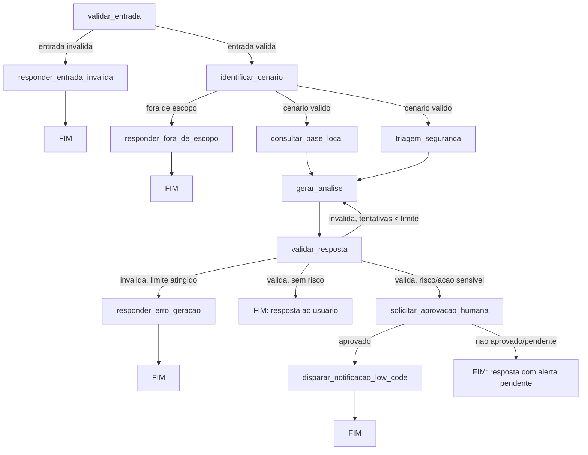

# Assistente para Reforma Tributária

Assistente baseado em agentes para apoiar consultas sobre a Reforma Tributária brasileira.

## Status: em desenvolvimento — estrutura inicial

## Descrição da solução

**Nome do projeto:** Assistente para Reforma Tributária.

**Problema resolvido:** empresas que usam ERP precisam revisar cadastros,
cálculos e documentos fiscais por causa da Reforma Tributária (IBS/CBS).
Times de desenvolvimento e analistas de sistemas têm dificuldade em
identificar rapidamente o que precisa mudar no sistema diante do volume
de mudanças trazidas pela reforma.

**Público:** desenvolvedores e analistas de sistemas que mantêm ERPs.

**Objetivo:** dado um dos três cenários suportados (cadastro de produtos,
emissão de nota fiscal, cálculo de IBS/CBS), descritos em linguagem
natural pelo usuário, o assistente retorna uma resposta estruturada
identificando o cenário, os pontos da reforma relacionados, os impactos
técnicos no ERP, os pontos de atenção e um checklist técnico.

**Valor entregue:** apoio técnico inicial para priorizar o que revisar no
sistema — **não** um parecer jurídico/fiscal definitivo.

> Este projeto é uma evolução do mini-projeto desenvolvido no módulo
> anterior, reaproveitando o grafo base, a tool de consulta à base local e
> a configuração multi-LLM, e adicionando paralelização, triagem de
> segurança, aprovação humana, memória de sessão, observabilidade,
> QA/DevOps com IA e automação low-code. Detalhes completos em
> [docs/escopo.md](docs/escopo.md).

## Classificação e arquitetura

**Classificação: sistema híbrido.**

A maior parte do fluxo é workflow determinístico (validação de entrada,
identificação de cenário por regras, triagem de segurança, controle de
retry e condição de parada), e um único nó é agêntico: o LLM decide como
sintetizar a resposta final a partir do contexto recuperado — mas nunca
decide sozinho sobre autonomia, segurança ou quais ferramentas executar;
isso é sempre regra determinística da aplicação.

**Justificativa:** um domínio fiscal/tributário exige rastreabilidade e
previsibilidade. Deixar decisões de segurança/roteamento a cargo do
modelo aumentaria o risco sem necessidade real, já que os cenários
suportados são bem definidos. Ver detalhamento completo em
[docs/escopo.md](docs/escopo.md).

### Diagrama de arquitetura

O diagrama abaixo representa o fluxo completo planejado para o projeto
(ainda não implementado nesta etapa — a implementação ocorre nas Etapas 2
a 12):



## Instalação e execução

1. Crie e ative um ambiente virtual:

   ```bash
   python -m venv .venv
   # Linux/macOS
   source .venv/bin/activate
   # Windows (PowerShell)
   .venv\Scripts\Activate.ps1
   ```

2. Instale as dependências:

   ```bash
   pip install -r requirements.txt
   ```

3. Copie `.env.example` para `.env` e preencha a chave do provedor
   padrão (`GOOGLE_API_KEY`, obtida no
   [Google AI Studio](https://aistudio.google.com/app/apikey)) — ou as
   variáveis do provedor escolhido, caso troque `LLM_PROVIDER` (ver
   seção abaixo):

   ```bash
   cp .env.example .env
   ```

4. Rode os testes:

   ```bash
   pytest tests/ -v
   ```

   Nesta etapa, os testes cobrem apenas a camada de configuração
   (`app/config.py`) e a fábrica de LLM (`app/llm/factory.py`), sem
   nenhuma chamada real a provedores de LLM — os testes rodam sem
   nenhuma API key real configurada.

### Provedores de LLM suportados

A aplicação suporta três provedores de LLM, alternáveis apenas por
variável de ambiente (`LLM_PROVIDER`), sem qualquer alteração de código:

| `LLM_PROVIDER` | Modelo padrão | Variável de API key |
|----------------|---------------|----------------------|
| `gemini` (padrão) | `gemini-3-flash` | `GOOGLE_API_KEY` |
| `anthropic`    | `claude-sonnet-5` | `ANTHROPIC_API_KEY` |
| `openai`       | `gpt-5.1`      | `OPENAI_API_KEY` |

O **Gemini 3 Flash** é o provedor padrão recomendado pelo melhor
custo-benefício. Para trocar de provedor, altere `LLM_PROVIDER` no `.env`
e preencha a API key correspondente — nenhum código precisa ser alterado,
pois toda a lógica de seleção do client fica centralizada em
`app/llm/factory.py`.
